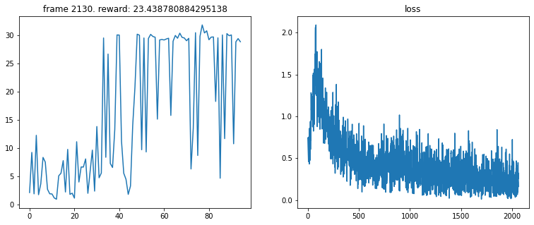

# Reinforcement Learning Assignment
## 1. Description
### 1.1 Training your first Reinforcement Learning agent
The goal of this repo is to build deep neural networks that we will train to act as our policy (strategy) for a Reinforcement Learning agent. The neural network will map observations to actions.

A reinforcement learning agent can use a table, function or neural network to map observations to actions. Depending on the observations different neural network architectures can be used e.g. CNNs for image data.

In this repo, you'll implement a reinforcement learning agent with the python library [skrl](https://skrl.readthedocs.io/en/latest/). You will set up the neural network for our policy. The environment you will be working on is the classic `cartpole` environment in `Gym` from [gymlibrary.dev](https://www.gymlibrary.dev) (formerly OpenAI Gym).

The purpose of training such an agent, is to have it learn how to take the proper actions to balance the pole on the cart. Similar techniques can be used to control other processess for example in industrial machines and processes.

### 1.2 Task
You’ll use `skrl` to set up and train a `Deep Deterministic Policy Gradient (DDPG)` agent to balance a pole in the `cartpole` environment. Specifically, you'll build a deep learning model that maps observations from the environment to relevant actions that the agent must take to maximize its rewards over time.

## 2. Getting started
The assignment can be set up in Google Colab. This section shows you how to set up your local programming environment.

## 3. Training and Evaluation

## 4. Data Visualization
The training can be followed in Tensorboard where the reward from each timestep/episode is plotted and can easily be compared to previous training runs.

## 5. Assignment instructions
What task(s) should the student do e.g. implement certain lines of code?

## 6. Expected results
The training should yield a similar result as below.

## 7. Getting help
Ask on Moodle or contact Simon Bøgh at sb@mp.aau.dk or Nestor Arana Arexolaleiba at narana@mondragon.edu.